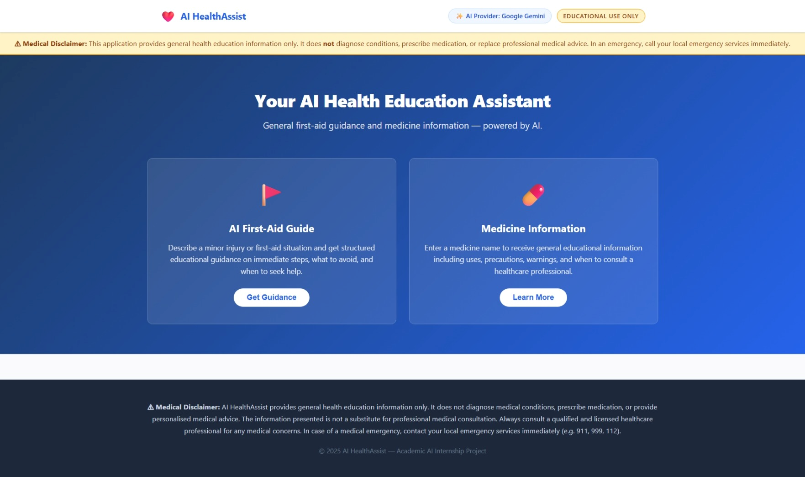
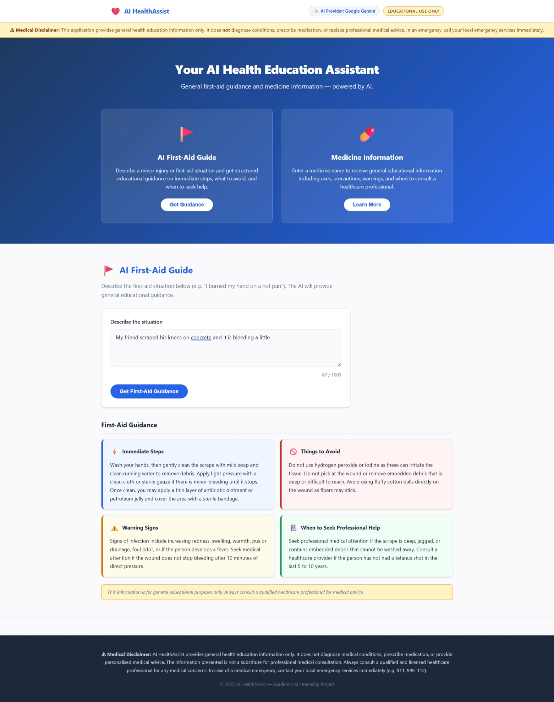
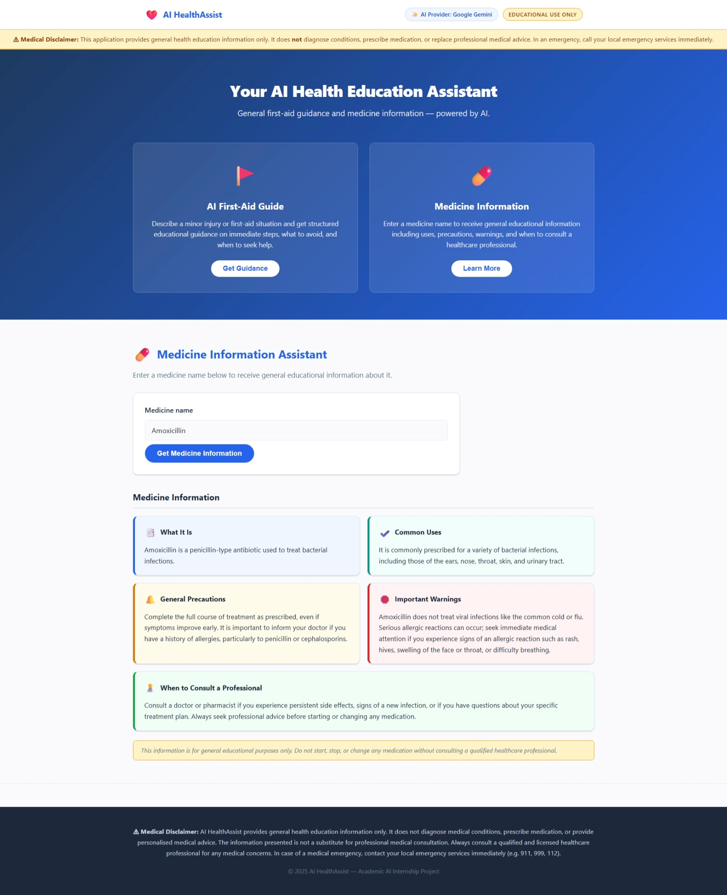

# 🩺 AI HealthAssist

An AI-powered healthcare education web application providing general first-aid guidance and medicine information — powered by **Google Gemini** (default) or **IBM watsonx.ai** (optional).

> ⚠️ **Medical Disclaimer:** This application is for **general educational purposes only**. It does not diagnose medical conditions, prescribe medication, or replace professional medical advice. Always consult a qualified healthcare professional for medical decisions. In an emergency, call your local emergency services immediately (e.g. 911, 999, 112).

---

## ✨ Features

### 🤕 AI First-Aid Guide

Describe a first-aid situation in natural language and the AI generates situation-specific educational guidance covering:

- Immediate steps
- Things to avoid
- Warning signs
- When to seek professional help

### 💊 Medicine Information Assistant

Enter a medicine name to receive general educational information covering:

- What it is
- Common uses
- General precautions
- Important warnings
- When to consult a healthcare professional

### 🤖 Multiple AI Providers

The application uses a provider-based architecture supporting:

- **Google Gemini** — Default and recommended provider
- **IBM watsonx.ai** — Optional provider

The active provider can be changed through a single environment variable.

### 🔐 Secure Configuration

- API keys are stored in environment variables.
- `.env` is excluded from Git.
- API credentials are never exposed to frontend JavaScript.

### 📱 Responsive Interface

The application uses a lightweight frontend built with HTML, CSS and vanilla JavaScript.

---

## 🛠️ Technology Stack

| Layer | Technology |
|---|---|
| Backend | Python 3.10+, Flask |
| AI Provider (default) | Google Gemini (`google-genai` SDK) |
| AI Provider (optional) | IBM watsonx.ai (`ibm-watsonx-ai` SDK) |
| Frontend | HTML5, CSS3, Vanilla JavaScript |
| Config | python-dotenv |

---

# 📸 Screenshots

## 🖥️ Application Interface

The main AI HealthAssist interface provides access to both AI-powered healthcare features from a single responsive web application.



---

## 🤕 AI First-Aid Guide

The First-Aid Guide accepts a user's situation and generates structured, AI-powered educational guidance including immediate steps, things to avoid, warning signs, and when to seek professional help.



---

## 💊 Medicine Information Assistant

The Medicine Information Assistant uses AI to generate general educational information about a medicine, including its uses, precautions, warnings, and when to consult a healthcare professional.



---

## 🏗️ AI Architecture

```
User Request
    │
    ▼
Flask API Route (app.py)
    │
    ▼
AI Provider Router (services/ai_provider.py)
    │
    ├─── AI_PROVIDER=gemini  ──▶  services/gemini_service.py  ──▶  Google Gemini API
    │                              - Structured JSON output
    │                              - Response schema enforced
    │                              - Retry on transient 503/429
    │
    └─── AI_PROVIDER=watsonx ──▶  services/watsonx_service.py ──▶  IBM watsonx.ai
                                   - Text generation with section parsing
                                   - Requires IBM credentials
```

**Google Gemini is the default and recommended provider.** IBM watsonx.ai is preserved for future use.

---

## Quick Start

### 1. Clone and enter the project

```bash
git clone <repository-url>
cd AI-HealthAssist
```

### 2. Create a virtual environment

```bash
python -m venv .venv
.venv\Scripts\activate        # Windows
# source .venv/bin/activate   # macOS / Linux
```

### 3. Install dependencies

```bash
pip install -r requirements.txt
```

### 4. Configure environment

```bash
copy .env.example .env        # Windows
# cp .env.example .env        # macOS / Linux
```

Edit `.env` and add your **Gemini API key**:

```env
AI_PROVIDER=gemini
GEMINI_API_KEY=your_gemini_api_key_here
GEMINI_MODEL=gemini-3.6-flash
```

> Get a free Gemini API key at: **https://aistudio.google.com/apikey**

### 5. Run

```bash
python app.py
```

Open [http://localhost:5000](http://localhost:5000).

---

## Environment Variables

| Variable | Required | Default | Description |
|---|---|---|---|
| `AI_PROVIDER` | No | `gemini` | `gemini` or `watsonx` |
| `GEMINI_API_KEY` | When `AI_PROVIDER=gemini` | — | Google Gemini API key |
| `GEMINI_MODEL` | No | `gemini-3.6-flash` | Gemini model ID |
| `WATSONX_API_KEY` | When `AI_PROVIDER=watsonx` | — | IBM Cloud API key |
| `WATSONX_PROJECT_ID` | When `AI_PROVIDER=watsonx` | — | watsonx.ai project ID |
| `WATSONX_URL` | When `AI_PROVIDER=watsonx` | `https://us-south.ml.cloud.ibm.com` | Regional endpoint |
| `WATSONX_MODEL_ID` | No | `meta-llama/llama-3-8b-instruct` | IBM model ID |
| `FLASK_DEBUG` | No | `false` | Enable Flask hot-reload |

---

## Switching AI Providers

### Use Google Gemini (default)

```env
AI_PROVIDER=gemini
GEMINI_API_KEY=your_key_here
GEMINI_MODEL=gemini-3.6-flash
```

### Use IBM watsonx.ai

```env
AI_PROVIDER=watsonx
WATSONX_API_KEY=your_ibm_cloud_api_key
WATSONX_PROJECT_ID=your_project_id
WATSONX_URL=https://us-south.ml.cloud.ibm.com
WATSONX_MODEL_ID=meta-llama/llama-3-8b-instruct
```

> **IBM Regional URLs:** Dallas: `https://us-south.ml.cloud.ibm.com` · Frankfurt: `https://eu-de.ml.cloud.ibm.com` · Tokyo: `https://jp-tok.ml.cloud.ibm.com` · London: `https://eu-gb.ml.cloud.ibm.com`

---

##📁 Project Structure
AI-HealthAssist/
│
├── app.py
├── requirements.txt
├── .env.example
├── .gitignore
├── README.md
├── ai-healthassist-plan.md
│
├── services/
│   ├── __init__.py
│   ├── ai_provider.py
│   ├── gemini_service.py
│   └── watsonx_service.py
│
├── static/
│   ├── css/
│   │   └── style.css
│   └── js/
│       └── main.js
│
└── templates/
    └── index.html

---

## 🔌 API Endpoints

### `GET /api/provider`

Returns the currently active AI provider name.

```json
{ "provider": "Google Gemini" }
```

### `POST /api/first-aid`

**Request:**
```json
{ "situation": "I burned my hand on a hot pan" }
```

**Response (200):**
```json
{
  "immediate_steps": "Cool the burn immediately under cool running water...",
  "things_to_avoid": "Do not apply butter, toothpaste, or ice...",
  "warning_signs": "Seek urgent care if the burn is larger than 3 inches...",
  "when_to_seek_help": "Go to the emergency room if there is charring..."
}
```

**Error (400 / 503):**
```json
{ "error": "Descriptive error message" }
```

### `POST /api/medicine`

**Request:**
```json
{ "medicine": "Ibuprofen" }
```

**Response (200):**
```json
{
  "what_it_is": "Ibuprofen is a nonsteroidal anti-inflammatory drug (NSAID)...",
  "common_uses": "Used to relieve mild to moderate pain...",
  "general_precautions": "Take with food to reduce stomach irritation...",
  "important_warnings": "Can increase the risk of heart attack or stroke...",
  "when_to_consult": "Consult your doctor before use if you have kidney disease..."
}
```

---

## 🤖 Gemini Integration Details

- **SDK:** `google-genai` v2.18.1 (current official Google Gemini Python SDK)
- **Default model:** `gemini-3.6-flash`
- **Output mode:** Structured JSON via `response_mime_type="application/json"` and `response_json_schema`
- **Retry logic:** Automatic retry (up to 3 attempts with backoff) on transient `503`/`429` errors
- **Safety:** System instruction prompt enforces educational-only responses, no diagnosis, no dosage

---

## 🏢 IBM watsonx.ai Integration Details

- **SDK:** `ibm-watsonx-ai` v1.6.3
- **Default model:** `meta-llama/llama-3-8b-instruct` (configurable)
- **Output mode:** Text generation with section-header parsing
- **Status:** Fully preserved; requires valid IBM Cloud credentials to activate

---

## 🛡️ Safety & Disclaimers

- Responses are for **general educational purposes only**
- The AI does **not** diagnose medical conditions
- The AI does **not** prescribe medication or recommend dosages
- The AI does **not** advise starting, stopping, or changing medication
- For emergencies, users are always directed to call emergency services
- Unknown medicines are identified as unrecognised — the AI does not invent information

---

## 📄 License

This project is built as an academic AI internship demonstration. See your institution's guidelines for usage terms.
